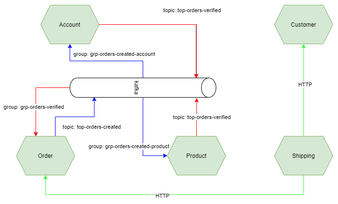

# Sample for Kafka Messaging in Microservices
Kafka Messaging system to organize the communication among the event-based microservices

# Architecture diagram
Below the diagram that shows how the microservices communicate with each others



# Installation
`mvn clean install -DskipTests`

# Deployment
Locally, we can start those applications
- localhost:8085 => account
- localhost:8086 => order
- localhost:8087 => product
- localhost:8088 => shipping
- localhost:8089 => customer

# Tests
## Create a Customer
```
curl --location --request POST 'localhost:8089/customers' \
--header 'Content-Type: application/json' \
--data-raw '{
    "name": "Hai"
}'
```
## Create an Account
```
curl --location --request POST 'localhost:8085/accounts' \
--header 'Content-Type: application/json' \
--data-raw '{
    "number": "Hai account",
    "balance": "50.7",
    "customerId": "<6048943b18e30716334e84fc>"
}'
```
## Create a Product
```
curl --location --request POST 'localhost:8087/products' \
--header 'Content-Type: application/json' \
--data-raw '{
    "name": "Red Hat",
    "price": "2.4",
    "count": 1
}'
```
## Create an Order
```
curl --location --request POST 'localhost:8086/orders' \
--header 'Content-Type: application/json' \
--data-raw '{
    "customerId": "<6048943b18e30716334e84fc>",
    "accountId": "<60489709948eb87bf1f10e9d>",
    "productIds": [
        "<6043e3d2d3af3842817413e6>"
    ],
    "price": 2.0
}'
```
## Create a Shipping
```
curl --location --request POST 'localhost:8088/shippings' \
--header 'Content-Type: application/json' \
--data-raw '{
    "customerId": "<6048943b18e30716334e84fc>",
    "orderIds": [
        "<6043e45b64df61448783836d>",
        "<60488de96f251d58d7f96e23>"
    ],
    "messages": [
        {
            "notes": "Go to Etown3 and call, urgent"
        }
    ]
}'
```


